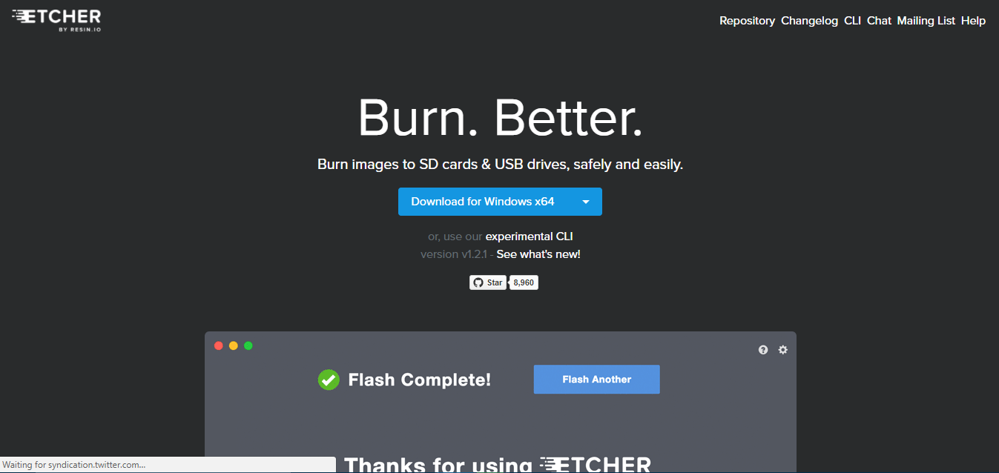
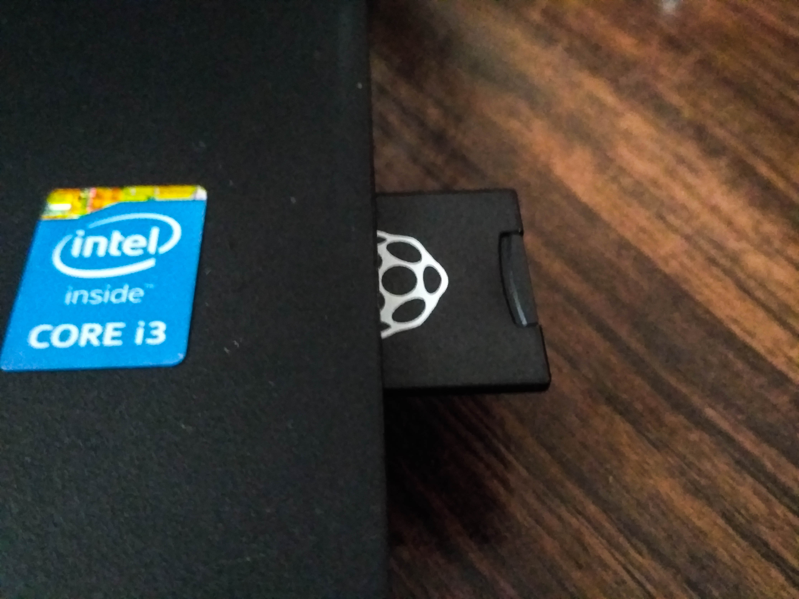
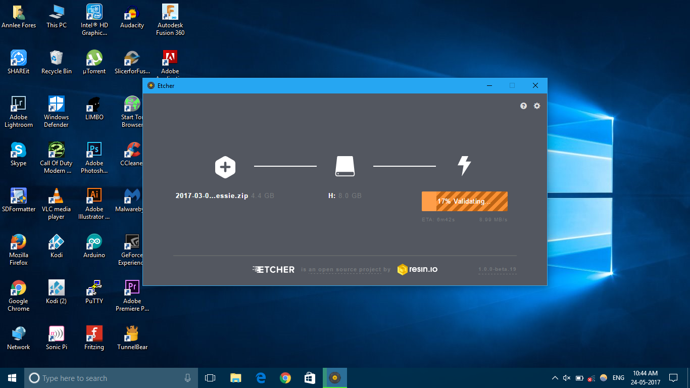
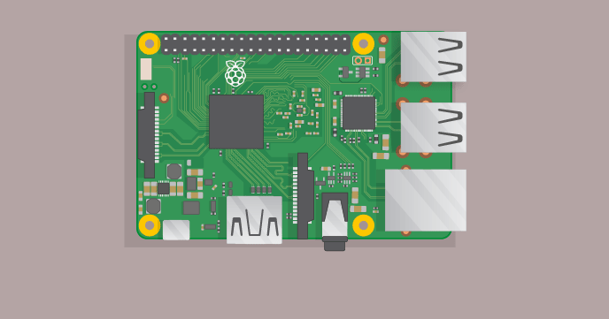
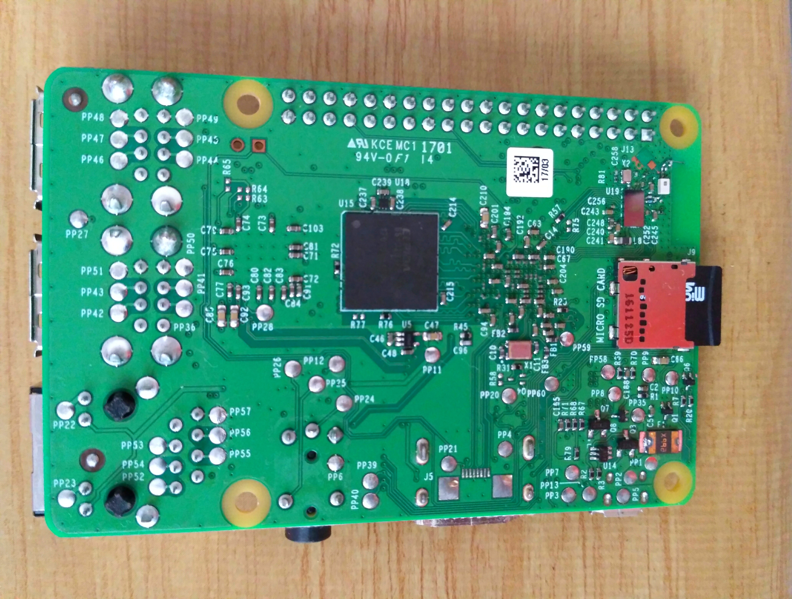
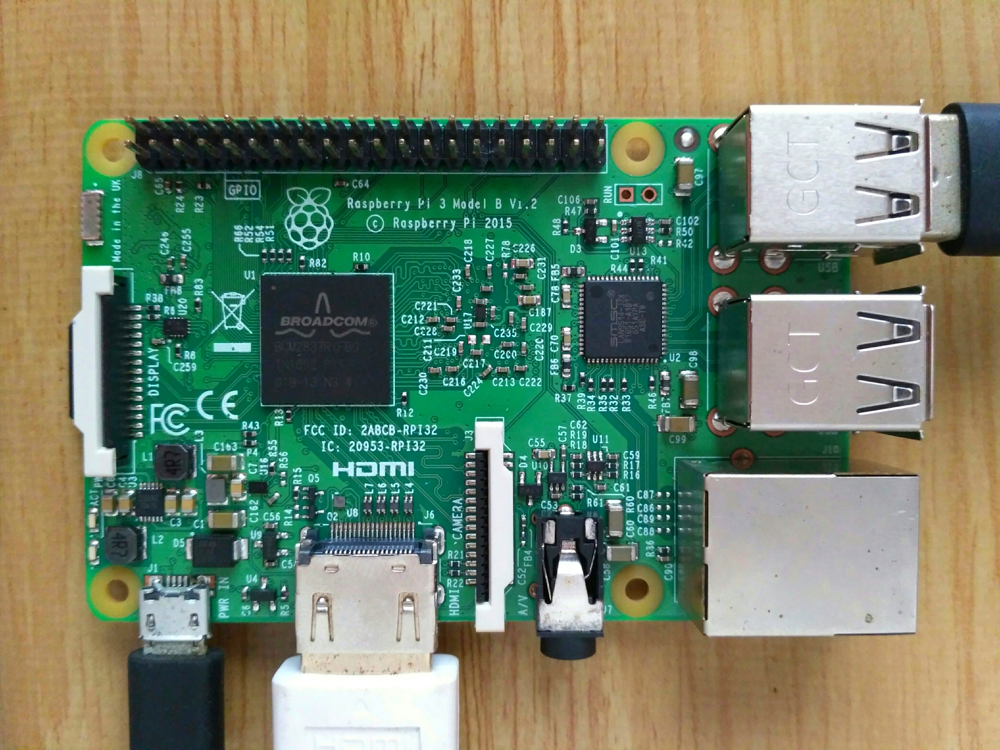

Setting up a Raspberry Pi is very easy. This workshop will walk you through most of the steps, however procedures may differ, depending on your specific model!

## Things Needed:

1. Raspberry Pi
1. Micro SD card 8 GB and above
1. Keyboard
1. Mouse
1. Monitor
1. HDMI cable
1. 5V smartphone charger (2A)

## Video tutorial

*Credits: [Raspberry Pi Foundation](http://www.raspberrypi.org) & MagPi team*

[youtu.be/FoFruCqjDHU](https://youtu.be/FoFruCqjDHU)

## Preparing the SD card

You can download the latest version of Raspbian from [https://www.raspberrypi.org/downloads/](https://www.raspberrypi.org/downloads/)

To burn your image onto your SD card you will need a software called Etcher by Resin.io. Download Etcher from here [https://etcher.io/](https://etcher.io/)

Using an SD card adapter connect the SD card to your computer.

Using Etcher burn the downloaded Raspbian image on to the SD card.

Or you could use the NOOBS (New Out Of the Box) OS image given on the website. It is basically an installer of multiple operating system distributions which includes the Raspbian image. You can also sideload other operating systems using NOOBS. 

Just download the file given and extract the contents onto the micro SD card. Pop it inside the micro SD card slot on the Raspberry Pi. Boot it up and select the operating system you want to install. Wait for the OS to install and you are good to go!

## Booting Up

Insert the micro SD card inside the Raspberry Pi. Connect the Raspberry Pi to a monitor using an HDMI cable. Connect a 5v adapter to the power port. 

Power up the Pi you should see the two indicator LEDs blinking and Raspbian desktop booting into the Raspbian UI.

Make your way through the Raspbian OS. Default username & password for Raspberry Pi is `pi` & `raspberry` respectively.

That’s it! You have set up your Raspberry Pi. Try out the different software available in the Raspbian OS.
